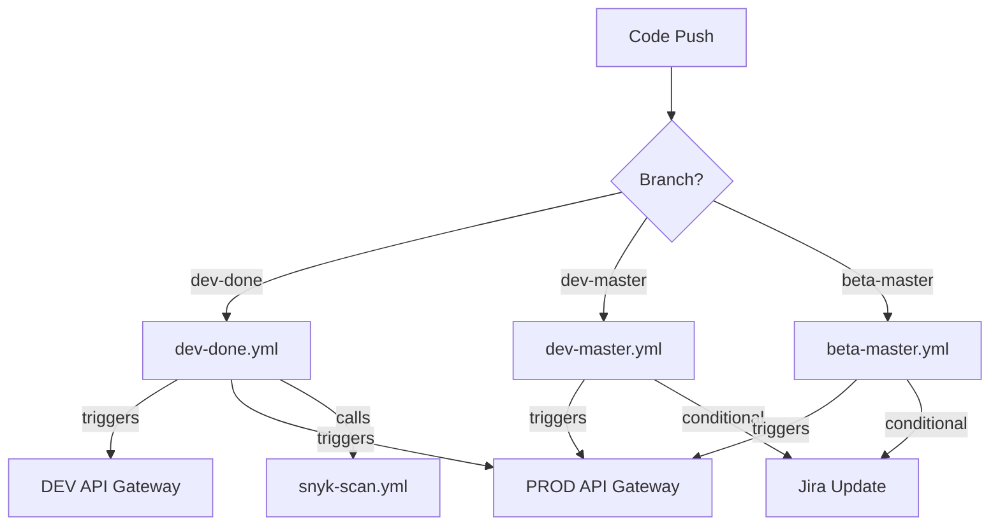

# Bitbucket to GitHub Actions Migration Guide

This repository demonstrates a modular approach to migrating CI/CD pipelines from Bitbucket Pipelines to GitHub Actions. The migration focuses on creating maintainable, reusable workflows while preserving the original functionality.

## 📋 Migration Overview

### Original Bitbucket Pipeline Features
- Multi-branch support (`dev-done`, `dev-master`, `beta-master`)
- API Gateway triggers for different environments
- Conditional Jira updates based on commit messages
- Snyk security scanning
- Different workflows for different branches

### Migration Goals
- Create a modular, maintainable GitHub Actions workflow structure
- Follow GitHub Actions best practices
- Preserve all original functionality
- Improve reusability of workflow components

## 🏗️ Workflow Architecture

The monolithic Bitbucket pipeline has been broken down into multiple specialized GitHub Actions workflows:

```
.github/workflows/
├── dev-done.yml        # Handles dev-done branch-specific actions
├── dev-master.yml      # Handles dev-master branch-specific actions
├── beta-master.yml     # Handles beta-master branch-specific actions
└── snyk-scan.yml       # Reusable security scanning workflow
```

### Workflow Relationships



## 📄 Workflow Descriptions

### 1. Branch-Specific Workflows

#### `dev-done.yml`
Triggered when code is pushed to the `dev-done` branch:
- Sends notifications to both DEV and PROD API Gateway endpoints
- Calls the Snyk security scan workflow

#### `dev-master.yml`
Triggered when code is pushed to the `dev-master` branch:
- Sends notifications only to the PROD/staging API Gateway endpoint
- Performs conditional Jira updates based on commit messages and source branch

#### `beta-master.yml`
Triggered when code is pushed to the `beta-master` branch:
- Sends notifications only to the PROD/staging API Gateway endpoint
- Performs conditional Jira updates using a different source branch variable

### 2. Reusable Workflows

#### `snyk-scan.yml`
A reusable workflow for security scanning:
- Uses the `workflow_call` trigger to enable reuse from other workflows
- Runs the Snyk security scan in a custom container
- Uploads scan results as artifacts

## 🔧 Implementation Details

### GitHub Secrets
The following secrets need to be configured in your repository:

- `DEV_API_GATEWAY_URL`: URL endpoint for the development environment
- `DEV_API_KEY`: API key for development environment
- `PROD_API_GATEWAY_URL`: URL endpoint for the production/staging environment
- `PROD_API_KEY`: API key for production environment
- `SNYK_TOKEN`: Authentication token for Snyk scanning

### GitHub Variables
Configure these repository variables:

- `JIRA_DEV_SOURCE_BRANCH`: Source branch pattern for dev environment Jira updates
- `JIRA_STAGING_SOURCE_BRANCH`: Source branch pattern for staging environment Jira updates

## 📝 Key Migration Differences

### Bitbucket vs. GitHub Variables
```
# Bitbucket                  # GitHub
${BITBUCKET_REPO_FULL_NAME}  ${{ github.repository }}
${BITBUCKET_BRANCH}          ${{ github.ref_name }}
${BITBUCKET_COMMIT}          ${{ github.sha }}
${BITBUCKET_PR_ID}           (Needs GitHub CLI query)
```

### Conditional Logic
Bitbucket Pipelines uses YAML anchors (`&trigger_dev_staging_api`), while GitHub Actions uses separate workflow files with specific triggers.

### Container Usage
Both platforms support container-based actions, but GitHub requires specific syntax for running steps within containers.

## 🚀 Benefits of This Approach

1. **Modularity**: Each workflow has a clear, specific purpose
2. **Maintainability**: Smaller files are easier to understand and modify
3. **Reusability**: Common functionality extracted into reusable workflows
4. **Reduced Risk**: Changes to one workflow don't impact others
5. **Better Adherence**: Follows GitHub's best practices and patterns

## 🧩 Example: Using the Reusable Snyk Scan

The Snyk security scan is implemented as a reusable workflow:

```yaml
# In a branch-specific workflow
jobs:
  # Other jobs...
  
  snyk_scan:
    needs: trigger_dev_staging_api  # Ensures API trigger completes first
    uses: ./.github/workflows/snyk-scan.yml  # Calls the Snyk scan workflow
```

## 📚 Additional Resources

- [GitHub Actions Documentation](https://docs.github.com/en/actions)
- [Reusable Workflows](https://docs.github.com/en/actions/using-workflows/reusing-workflows)
- [Migrating from Bitbucket Pipelines](https://docs.github.com/en/actions/migrating-to-github-actions/using-github-actions-importer-to-automate-migrations/migrating-from-bitbucket-pipelines-with-github-actions-importer)


Contributors
	•	Etunyi Ashime (@github.com:snipesa)